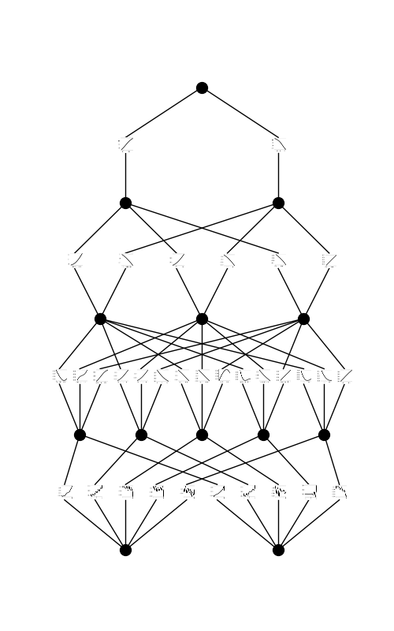
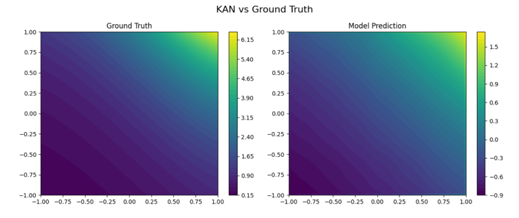
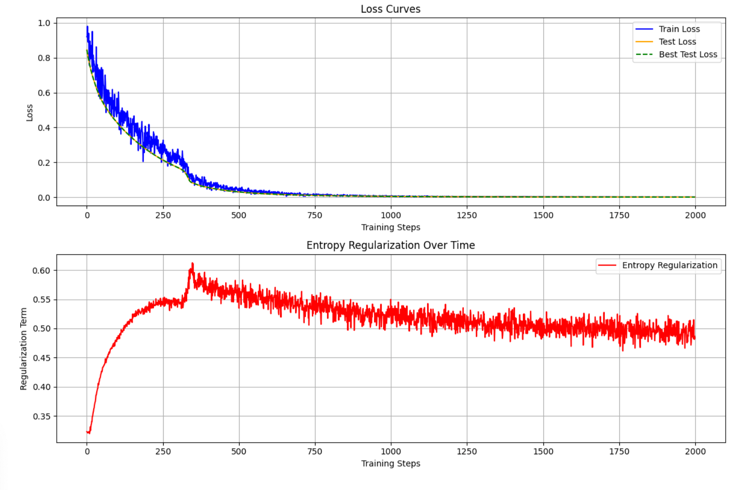

# Kolmogorov–Arnold Networks (KAN) — PyTorch Implementation

This repository contains a **from-scratch PyTorch implementation** of **Kolmogorov–Arnold Networks (KANs)**, as described in the 2024 paper ["Kolmogorov–Arnold Networks"](https://arxiv.org/abs/2304.00554). Unlike traditional MLPs that learn weights between nodes, KANs learn **adaptive basis functions** at each connection, offering better generalization and interpretability.

---

## Mathematical Background

### Kolmogorov–Arnold Theorem

> Any multivariate continuous function $( f: \mathbb{R}^n \to \mathbb{R} )$ can be represented as a composition of continuous univariate functions and addition.

KANs build on this by learning such representations using **spline-based adaptive functions**.


---

### Spline-Based Basis

Given a set of knots $( t_0, t_1, \ldots, t_m )$, a **B-spline basis function** of degree \( k \) is recursively defined using the **Cox–de Boor** formula:

- Base case:

```math
B_{i,0}(x) = 
  { 1\ if\ t_{i} ≤ x < t_{i+1}
    0\ otherwise }
```

- Recursive case:

```math
B_{i,k}(x) = \frac{x - t_i}{t_{i+k} - t_i}e · B_{i,k−1}(x) + \frac{t_{i+k+1} - x}{t_{i+k+1} - t_{i+1}} · B_{i+1,k−1}(x)
```

KANs use these basis functions as **adaptive transformations** applied to each input dimension.  

Example Visualization for basis function:

---

### Model Forward Function

A typical KAN layer output is:
```math
y_j = \sum_{i=1}^{d} \sum_{b=1}^{B} w_{ijb} \cdot B_b(x_i) 
``` 
where:
- $B_b(x_i)$ is the $( b^\text{th} )$ spline basis on input dimension $(x_i)$
- $w_{ijb}$ are learnable weights
- $d$ is input dimension, $B$ is number of basis per dimension  

Model Results for 
```math
f(x, y) = exp(sin(πx) + y²)
```


---

## Training Setup

We train the KAN model to fit the synthetic function:

```math
f(x, y) = exp(sin(πx) + y²)
```

The loss combines **MSE** and a regularization term on spline smoothness:

```math
𝓛 = MSE(f_{KAN}, f_{true}) + λ · Reg
```


---

## Acknowledgments

This implementation was inspired by [Alex L. Zhang's Implementation](https://alexzhang13.github.io/blog/2024/annotated-kan/#part-iii-kan-specific-optimizations).
