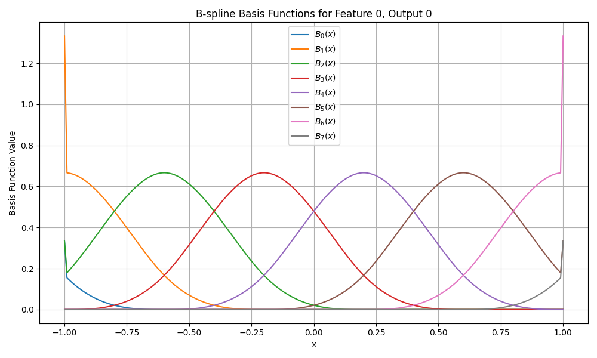

# B-Spline Utilities

This module implements B-spline basis functions using the Cox–de Boor recursion, and provides utilities to visualize them.

---

## Files

- `knots_generator.py`: Generates knot/control points for B-splines.
- `basis_function.py`: Computes B-spline basis values given input `x` and grid.
- `visualization.py`: Plots the basis functions for a selected feature.

---

## Example Usage

```python
import torch
from bspline.knots_generator import generate_knots
from bspline.basis_function import calculate_bspline
from bspline.visualization import visualize_bspline_basis

# Set device
device = torch.device("mps" if torch.backends.mps.is_available() else "cpu")

# Define input values
x = torch.linspace(-1, 1, steps=200).unsqueeze(1)  # shape (200, 1)

# Generate knots
grid = generate_knots(
    low=-1, high=1, k=3, G=5,
    in_dim=1, out_dim=1,
    device=device
)

# Calculate basis functions and visualize
bases = calculate_bspline(x, grid, k=3, device=device)
visualize_bspline_basis(x, bases)
```

---

## Output

The plot will show overlapping B-spline basis functions:

